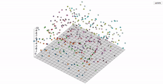
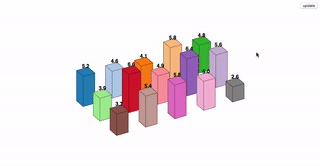
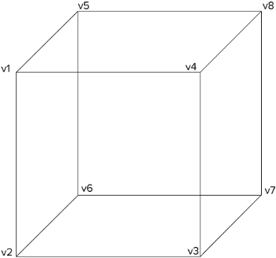

# d3-3d
**d3-3d** is meant for 3d visualizations. **d3-3d** allows the projection of 3d data onto the screen in the webbrowser. It is specially designed to work with **[d3.js](https://d3js.org/)**.

[](https://opensource.org/licenses/BSD-3-Clause)
<a href="https://www.npmjs.com/package/d3-3d"></a>
<a href="https://www.paypal.me/niekes/5" rel="nofollow"></a>

<table>
    <tr>
        <td> <a target="_blank" href="https://bl.ocks.org/niekes/e920c03edd7950578b8a6cded8b5a1a5">  </a> </td>
        <td> <a target="_blank" href="https://bl.ocks.org/niekes/1c15016ae5b5f11508f92852057136b5">  </a> </td>
        <td> <a target="_blank" href="https://bl.ocks.org/niekes/613d43d39372f99ae2dcea14f0f90617">  </a> </td>
    </tr>
</table>
See more <a href="https://bl.ocks.org/niekes" target="_blank">examples</a>.

## Installing

If you use npm, `npm install d3-3d`. You can also download the [latest release](https://github.com/Niekes/d3-3d/releases). Otherwise use [unpkg](https://unpkg.com/d3-3d/) to get the latest release. For example:

```html
<script src="https://unpkg.com/d3-3d/build/d3-3d.js"></script>
```

For a specific version:
```html
<script src="https://unpkg.com/d3-3d@version/build/d3-3d.js"></script>
```

For the minified version:

```html
<script src="https://unpkg.com/d3-3d@version/build/d3-3d.min.js"></script>
```

## API Reference

* [d3._3d](#_3d) - create a new 3d function object.
* [*_3d*.shape](#shape) - set the shape.
* [*_3d*.x](#x) - set the x accessor.
* [*_3d*.y](#y) - set the y accessor.
* [*_3d*.z](#z) - set the z accessor.
* [*_3d*.scale](#scale) - sets the scale for the projected points.
* [*_3d*.rotateX](#rotateX) - set the angle for the x rotation.
* [*_3d*.rotateY](#rotateY) - set the angle for the y rotation.
* [*_3d*.rotateZ](#rotateZ) - set the angle for the z rotation.
* [*_3d*.sort](#sort) - sort the 3d elements by the centroid.
* [*_3d*.draw](#draw) - draw the 3d elements.

### Overview
**d3-3d** uses the [browser's coordinate system](https://www.w3.org/TR/css-transforms-1/#transform-rendering) and [orthographic projection](https://en.wikipedia.org/wiki/Orthographic_projection) to display your data on the screen. It will calculate the centroid for all elements and the orientation for your polygons. Due to the fact that SVG isn't very 3d compatible **d3-3d** adds 3d transformations to SVG.

With **d3-3d** you can easily visualize your 3d data.
```js
var data3D = [ [[0,-1,0],[-1,1,0],[1,1,0]] ];

var triangles3D = d3._3d()
    .scale(100)
    .origin([480, 250])
    .shape('TRIANGLE');

var projectedData = triangles3D(data3D);

init(projectedData);

function init(data){

    var triangles = svg.selectAll('path').data(data);

    // add your logic here...

}
```
<a name="_3d" href="#_3d">#</a> d3.<b>_3d</b>() [<>](https://github.com/Niekes/d3-3d/blob/master/src/3d.js#L58 "Source")

Constructs a new function object with the default settings.

### Shapes
Depending on the shape the input data array has to be accordingly to the shape.
* **POINT** A point is represented by the `<circle>` element. It does not have a draw function because it can be represented as a `<circle>`. The input data array has to be an array of points where each point has three coordinates which can be accessed via the [x](#x), [y](#y) and [z](#z) accessors.
* **LINE** A line is represented by the `<line>` element. It does not have a draw function because it can be represented as a `<line>`. The input data array has to be an array of lines where each line is defined by a start- and an endpoint.
* **LINE_STRIP** A continuous line is represented by the `<path>` element.  The input data array has to be an array of points. Every point will be connected to the next point in the input data array.
* **TRIANGLE** A triangle represented by the `<path>` element. The input data array has to be an array of triangles where each triangle is defined by three points in counter-clockwise order.
* **PLANE** A plane is represented by the `<path>` element. The input data array has to be an array of planes where each plane is defined by four points in counter-clockwise order.
* **GRID** A grid is represented by x planes. The input data array has to be an array of points. The [shape](#shape) function aspects the amount of points per row as a second argument. **d3-3d** will construct planes out of the passed data.
_NOTE:_ A grid has to have always the same number of points per row. Otherwise the code will break.
* **SURFACE** equivalent to `GRID`
* **CUBE** A grid is represented by 4 planes. The input data array has to be an array of cubes where each cube is defined by 8 vertices. To get the orientation and centroid calculation right you should pass in the data like so:



<a name="shape" href="#shape">#</a> _3d.<b>shape</b>(shape) [<>](https://github.com/Niekes/d3-3d/blob/master/src/3d.js#L87 "Source")

_Default:_ `'POINT'`

Sets the shape to *shape*. If *shape* is not specified the current shape will be returned.

If *shape* is specified, sets the shape to the specified shape and returns the **d3-3d** function object. If *shape* is not specified, returns the current shape.

```js
var triangles3D = d3._3d().shape('TRIANGLE');
```

<a name="x" href="#x">#</a> _3d.<b>x</b>([x]) [<>](https://github.com/Niekes/d3-3d/blob/master/src/point.js#L1 "Source")

If *x* is specified, sets the x accessor to the specified function or number and returns the **d3-3d** function object. If *x* is not specified, returns the current x accessor, which defaults to:

```js
function x(p) {
    return p[0];
}
```
This function will be invoked for each point in the input data array.

<a name="y" href="#y">#</a> _3d.<b>y</b>([y]) [<>](https://github.com/Niekes/d3-3d/blob/master/src/point.js#L5 "Source")

If *y* is specified, sets the y accessor to the specified function or number and returns the **d3-3d** function object. If *y* is not specified, returns the current y accessor, which defaults to:

```js
function y(p) {
    return p[1];
}
```
This function will be invoked for each point in the input data array.

<a name="z" href="#z">#</a> _3d.<b>z</b>([z]) [<>](https://github.com/Niekes/d3-3d/blob/master/src/point.js#L9 "Source")

If *z* is specified, sets the z accessor to the specified function or number and returns the **d3-3d** function object. If *z* is not specified, returns the current z accessor, which defaults to:

```js
function z(p) {
    return p[2];
}
```
This function will be invoked for each point in the input data array.

<a name="scale" href="#scale">#</a> _3d.<b>scale</b>(scale) [<>](https://github.com/Niekes/d3-3d/blob/master/src/3d.js#L71 "Source")

_Default:_ `1`

If *scale* is specified, sets the scale to the specified number and returns the **d3-3d** function object. If *scale* is not specified, returns the current scale.

<a name="rotateX" href="#rotateX">#</a> _3d.<b>rotateX</b>(angle) [<>](https://github.com/Niekes/d3-3d/blob/master/src/3d.js#L75 "Source")

_Default:_ `0`

If *angle* is specified, sets rotateX to the specified number and returns the **d3-3d** function object. If *angle* is not specified, returns the current angle.

<a name="rotateY" href="#rotateY">#</a> _3d.<b>rotateY</b>(angle) [<>](https://github.com/Niekes/d3-3d/blob/master/src/3d.js#L79 "Source")

_Default:_ `0`

If *angle* is specified, sets rotateY to the specified number and returns the **d3-3d** function object. If *angle* is not specified, returns the current angle.

<a name="rotateZ" href="#rotateZ">#</a> _3d.<b>rotateZ</b>(angle) [<>](https://github.com/Niekes/d3-3d/blob/master/src/3d.js#L83 "Source")

_Default:_ `0`

If *angle* is specified, sets rotateZ to the specified number and returns the **d3-3d** function object. If *angle* is not specified, returns the current angle.

<a name="sort" href="#sort">#</a> _3d.<b>sort</b>(a,b) [<>](https://github.com/Niekes/d3-3d/blob/master/src/3d.js#107 "Source")

Sorts the elements accordingly to the z coordinate of the calculated centroid.

<a name="draw" href="#draw">#</a> _3d.<b>draw</b>(shape) [<>](https://github.com/Niekes/d3-3d/blob/master/src/3d.js#107 "Source")

Constructs a string for the SVG `<path>` element. Depending on the [shape](#shape) this function will take care how the elements get drawn. For instance, if you choose `'TRIANGLE'` **d3-3d** aspects that you want to draw a triangle with three points and each point has three coordinates. The [*_3d*.draw](#draw) method will draw a triangle with these three points. If you want to draw a plane, you have to pass in four points and so on.
