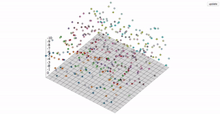
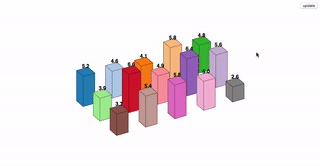
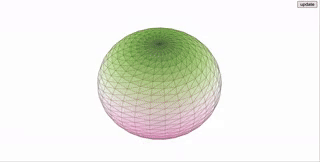

# d3-3d

**d3-3d** is meant for 3d visualizations. **d3-3d** allows the projection of 3d data onto the screen in the webbrowser. It is specially designed to work with **[d3.js](https://d3js.org/)**.

[![Build][build-badge]][build]
[![Coverage][coverage-badge]][coverage]
[](https://www.npmjs.com/package/d3-3d)
[](https://www.npmjs.com/package/d3-3d)
[](https://github.com/Niekes/d3-3d/blob/master/LICENSE)
[](https://bundlephobia.com/result?p=d3-3d)
[](https://www.npmjs.com/package/d3-3d)

<table>
    <tr style="background-color: #f6f8fa">
        <td><a target="_blank" href="https://codepen.io/Niekes/pen/YzBmYzR"></a></td>
        <td><a target="_blank" href="https://codepen.io/Niekes/pen/poGMpLw"></a></td>
        <td><a target="_blank" href="https://codepen.io/Niekes/pen/poGMKXY"> </a></td>
    </tr>
    <tr style="background-color: #f6f8fa">
        <td><a target="_blank" href="https://codepen.io/Niekes/pen/KKEPBVb"></a></td>
        <td><a target="_blank" href="https://codepen.io/Niekes/pen/wvbzGMG"></a></td>
        <td><a target="_blank" href="https://codepen.io/Niekes/pen/eYadJVg"> </a></td>
    </tr>
</table>

See more [examples][examples]

## Star History

[](https://www.star-history.com/#d3-3d/d3-3d&niekes/d3-3d&type=date&legend=bottom-right)

## Installing

If you use npm, `npm install d3-3d`. You can also download the [latest release](https://github.com/Niekes/d3-3d/releases). Otherwise use [unpkg](https://unpkg.com/d3-3d/) to get the latest release. For example:

```html
<script src="https://unpkg.com/d3-3d/build/d3-3d.js"></script>

<!-- OR -->

<script src="https://unpkg.com/d3-3d/build/d3-3d.min.js"></script>
```

For a specific version:

```html
<script src="https://unpkg.com/d3-3d@version/build/d3-3d.js"></script>
```

## Import

ES6:

```js
import { triangles3D, cubes3D, gridPlanes3D, points3D, lineStrips3D } from 'd3-3d';
```

## API Reference

- [triangles3D().x](#triangles3dxx) - set the x accessor.
- [triangles3D().y](#triangles3dyy) - set the y accessor.
- [triangles3D().z](#triangles3dzz) - set the z accessor.
- [triangles3D().scale](#triangles3dscalescale) - sets the scale for the projected points.
- [triangles3D().rotateX](#triangles3drotatexanglex) - set the angle for the x rotation.
- [triangles3D().rotateY](#triangles3drotateyangley) - set the angle for the y rotation.
- [triangles3D().rotateZ](#triangles3drotatezanglez) - set the angle for the z rotation.
- [triangles3D().rotateCenter](#triangles3drotatecenterrotatecenter) - set the the rotation center.
- [triangles3D().origin](#triangles3doriginorigin) - set the the origin.
- [triangles3D().sort](#triangles3dsort) - sort the 3d elements by the centroid.
- [triangles3D().draw](#triangles3ddraw) - draw the 3d elements.

### Overview

**d3-3d** uses the [browser's coordinate system](https://www.w3.org/TR/css-transforms-1/#transform-rendering) and [orthographic projection](https://en.wikipedia.org/wiki/Orthographic_projection) to display your data on the screen. It will calculate the centroid for all elements and the orientation for your polygons. Due to the fact that SVG isn't very 3d compatible **d3-3d** adds 3d transformations to SVG.

With **d3-3d** you can easily visualize your 3d data.

```js
const data3D = [
  [
    { x: 0, y: -1, z: 0 },
    { x: -1, y: 1, z: 0 },
    { x: 1, y: 1, z: 0 }
  ]
];

const triangles3d = triangles3D().scale(100).origin({ x: 480, y: 250 });

const projectedData = triangles3d(data3D);

init(projectedData);

function init(data) {
  const triangles = svg.selectAll('path').data(data);

  // add your logic here...
}
```

### Shapes

Depending on the shape the input data array has to be accordingly to the shape.

- **points3D** A point is represented by the `<circle>` element. It does not have a draw function because it can be represented as a `<circle>`. The input data array has to be an array of points where each point has three coordinates which can be accessed via the [x](#x), [y](#y) and [z](#z) accessors.
- **lines3D** A line is represented by the `<line>` element. It does not have a draw function because it can be represented as a `<line>`. The input data array has to be an array of lines where each line is defined by a start- and an endpoint.
- **lineStrips3D** A continuous line is represented by the `<path>` element. The input data array has to be an array of points. Every point will be connected to the next point in the input data array.
- **triangles3D** A triangle represented by the `<path>` element. The input data array has to be an array of triangles where each triangle is defined by three points in counter-clockwise order.
- **planes3D** A plane is represented by the `<path>` element. The input data array has to be an array of planes where each plane is defined by four points in counter-clockwise order.
- **gridPlanes3D** A grid is represented by _x_ planes. The input data array has to be an array of points. **d3-3d** will construct planes out of the passed data. _NOTE:_ A grid has to have always the same number of points per row. Otherwise the code will break.
- **polygons3D** A polygon is represented by the `<path>` element. The input data array has to be an array of polygons where each polygon is defined by _x_ points in counter-clockwise order.
- **cubes3D** A grid is represented by 4 planes. The input data array has to be an array of cubes where each cube is defined by 8 vertices. To get the orientation and centroid calculation right you should pass in the data like so:


#### triangles3D().x(_x_)

If _x_ is specified, sets the _x_ accessor to the specified function or number and returns the **d3-3d** function object. If _x_ is not specified, returns the current _x_ accessor, which defaults to:

```js
function x(p) {
  return p.x;
}
```

This function will be invoked for each point in the input data array.

#### triangles3D().y(_y_)

If _y_ is specified, sets the _y_ accessor to the specified function or number and returns the **d3-3d** function object. If _y_ is not specified, returns the current _y_ accessor, which defaults to:

```js
function y(p) {
  return p.y;
}
```

This function will be invoked for each point in the input data array.

#### triangles3D().z(_z_)

If _z_ is specified, sets the _z_ accessor to the specified function or number and returns the **d3-3d** function object. If _z_ is not specified, returns the current _z_ accessor, which defaults to:

```js
function z(p) {
  return p.z;
}
```

This function will be invoked for each point in the input data array.

#### triangles3D().scale(_scale_)

If _scale_ is specified, sets the _scale_ to the specified number and returns the **d3-3d** function object. If _scale_ is not specified, returns the current _scale_.

_Default:_ `1`

#### triangles3D().rotateX(_angleX_)

If _angleX_ is specified, sets _angleX_ to the specified number and returns the **d3-3d** function object. If _angleX_ is not specified, returns the current _angleX_.

_Default:_ `0`

_angleX_ should be expressed in radians, for example: `Math.PI / 4`.

#### triangles3D().rotateY(_angleY_)

If _angleY_ is specified, sets _angleY_ to the specified number and returns the **d3-3d** function object. If _angleY_ is not specified, returns the current _angleY_.

_Default:_ `0`

_angleY_ should be expressed in radians, for example: `Math.PI / 4`.

#### triangles3D().rotateZ(_angleZ_)

If _angleZ_ is specified, sets _angleZ_ to the specified number and returns the **d3-3d** function object. If _angleZ_ is not specified, returns the current _angleZ_.

_Default:_ `0`

_angleZ_ should be expressed in radians, for example: `Math.PI / 4`.

#### triangles3D().rotateCenter(_rotateCenter_)

If _rotateCenter_ is specified, sets rotateCenter to the specified point and returns the **d3-3d** function object. If _rotateCenter_ is not specified, returns the current _rotateCenter_.

_Default:_ `{ x: 0, y: 0, z: 0 }`

#### triangles3D().origin(_origin_)

If _origin_ is specified, sets origin to the specified point and returns the **d3-3d** function object. If _origin_ is not specified, returns the current _origin_.

_Default:_ `{ x: 0, y: 0 }`

#### triangles3D().sort()

Sorts the elements accordingly to the z coordinate of the calculated centroid.

#### triangles3D().draw()

This function constructs an SVG `<path>` element string based on the chosen [shape](#shapes). For example, selecting triangles3D in **d3-3d** implies drawing a triangle with three points, each having three coordinates `{ x: 0, y: 0, z: 0 }`. The `triangles3D().draw` method facilitates this. To draw a plane, provide four points, and so forth.

[](https://ko-fi.com/A0A3QJPZ9)

<!-- Definitions -->

[build-badge]: https://github.com/niekes/d3-3d/workflows/main/badge.svg
[build]: https://github.com/niekes/d3-3d/actions
[coverage-badge]: https://img.shields.io/codecov/c/github/niekes/d3-3d.svg
[coverage]: https://codecov.io/github/niekes/d3-3d
[examples]: https://codepen.io/collection/DpmByZ?sort_order=desc&sort_by=id

[start-history]: https://api.star-history.com/svg?repos=d3-3d/d3-3d,niekes/d3-3d&type=date&legend=bottom-right)](https://www.star-history.com/#d3-3d/d3-3d&niekes/d3-3d&type=date&legend=bottom-right
